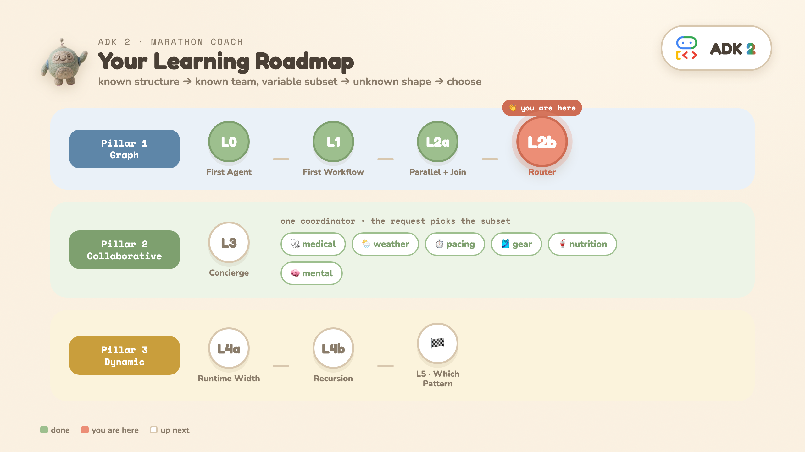

# ADK 2 Orchestration — a graded, runnable tutorial

> Learn ADK 2's **three orchestration patterns** — graph workflows, collaborative agents, dynamic workflows — one runnable rung at a time, all through a single **Marathon Race Day Coach**.

[](https://colab.research.google.com/github/cuppibla/adk2-tutorial/blob/main/notebooks/adk2_orchestration.ipynb)

<!-- Loads notebooks/ straight from this repo, so it is always current. No manual Drive re-upload. -->

There are three ways to take this tutorial. **All cover the same nine levels.**
- **📖 Codelab (guided)** — a step-by-step walkthrough that wraps the Colab: [`codelab/adk2-orchestration.md`](codelab/). Best for following along start to finish.
- **▶ Colab (zero setup)** — click the badge, add your API key, run cells top to bottom. Best for "just show me it running."
- **💻 Local (GitHub)** — clone, `./setup_venv.sh`, run each level as a module. Best for editing and keeping the code.

---

## The ladder



Every level answers one question, adds one idea, and stays runnable on its own. The domain is the same throughout, so the levels **accumulate** into the full app — one **Marathon Race Day Coach**:


| Level | The question it answers | What you learn | Run |
|---|---|---|---|
| **[P](shared/prologue.py)** · Prologue | Why not one big prompt? | run the mega-prompt, watch it **invent** its data | `python -m shared.prologue` |
| **[L0](L0_first_agent/)** · First agent | Can I get a model to answer — and use real code? | `Agent` + `Runner` + a **tool** the model chooses to call | `python -m L0_first_agent.agent` |
| **[L1](L1_graph_basics/)** · First workflow | How do code and an LLM share one flow? | `Workflow(edges=...)`; function node + agent node are peers | `python -m L1_graph_basics.workflow` |
| **[L2a](L2a_parallel_join/)** · Graph 1 (Pillar 1) | I can draw the flow ahead of time | parallel fan-out · `JoinNode` · one agent | `python -m L2a_parallel_join.workflow` |
| **[L2b](L2b_router/)** · Graph 2 (Pillar 1) | Branch without asking the model | deterministic `if`-router · dict edge · **1 LLM call** | `python -m L2b_router.workflow` |
| **[L3a](L3a_collaborative/)** · Collaborative (Pillar 2) | Known team, request picks the subset | same team run in `chat` then `single_turn` — one flag, two worlds | `python -m L3a_collaborative.concierge` |
| **[L3b](L3b_task_desk/)** · Task mode (Pillar 2) | Talk until the fields are collected, then return | `mode="task"` · paused task · `finish_task` · validated return | `python -m L3b_task_desk.desk` |
| **[L4a](L4a_flat_research/)** · Dynamic 1 (Pillar 3) | Runtime *width* | `@node(parallel_worker=True)` · runtime-sized fan-out | `python -m L4a_flat_research.deep_research` |
| **[L4b](L4b_recursion/)** · Dynamic 2 (Pillar 3) | Runtime *depth* | recursive `ctx.run_node` · bounded `MAX_DEPTH` | `python -m L4b_recursion.deep_research` |
| **[L5](L5_capstone/)** · Capstone | Which pattern, when? | the decision tree · 1.x-vs-2 · how they compose | *(reading)* |

**The through-line:** *known structure → known team/variable subset → unknown shape → choose the right one.*

---

## Quickstart — Local

Requires **Python 3.11+** and a Gemini API key ([get one free](https://aistudio.google.com/apikey)).

```bash
git clone https://github.com/cuppibla/adk2-tutorial.git && cd adk2-tutorial
./setup_venv.sh            # uv if available, else python venv + pip; also creates .env
# edit .env → paste your GOOGLE_API_KEY
```

There are **two ways to run locally** (they use the same code):

**A) Browse everything in the ADK web UI** — like the [`adk_tutorial`](https://github.com/cuppibla/adk_tutorial) repo. Each level folder re-exports `root_agent`, so `adk web` lists them all.
```bash
./run.sh                   # → http://localhost:8080, pick a level from the dropdown
```
> Only the **`L0…L4b`** folders (including `L3a`/`L3b`) are runnable agents. `shared/`, `notebooks/`, `codelab/`, `L5_capstone/` may also appear in the dropdown but aren't agents.

**B) Run one level with its teaching output** — the parallel timing, the router branch, the recursion trace. This is the recommended way to *learn* each pattern, and it mirrors the Colab cells 1:1.
```bash
python -m shared.prologue                                                # the 'before' picture: watch it invent data
python -m L0_first_agent.agent
python -m L1_graph_basics.workflow
python -m L2a_parallel_join.workflow HOT
python -m L2b_router.workflow COLD
python -m L3a_collaborative.concierge --mode chat "What about fueling?"   # watch chat mode strand
python -m L3a_collaborative.concierge "Should I race today?"
python -m L3b_task_desk.desk                                             # task: pause → resume → finish_task
python -m L4a_flat_research.deep_research
python -m L4b_recursion.deep_research
```

Always run levels as **modules from the repo root** (`python -m L2b_router.workflow`) so `from shared import ...` resolves.

## Quickstart — Colab

1. Open [`notebooks/adk2_orchestration.ipynb`](notebooks/adk2_orchestration.ipynb) in Colab (badge above, or upload it).
2. Runtime has no key — add yours via **🔑 Secrets** as `GOOGLE_API_KEY` (the first cell reads it), or paste it when prompted.
3. Run cells top to bottom. Each level is one runnable cell with a markdown explainer above it.

---

## What runs the model

- **Package:** `google-adk==2.3.0` (latest stable; every level was verified on it — see note below).
- **Model:** `gemini-flash-latest`.
- **Cost:** L0–L2b are cheap (0–1 model call each). L3a makes ~6–10 across its two beats; L3b ~4. **L4a is 5–9 calls; L4b is 5–30 per run** — run those deliberately.

> **Version note.** Verified on **2.3.0** and on 2.0.0b1. Every API this tutorial uses (`Workflow(edges=...)`, `JoinNode`, `@node(parallel_worker=True)`, `Agent(sub_agents=..., mode="single_turn")`) behaves identically on both.
>
> The ADK 2 line is **not** frozen, though: `mode="task"` could not be a static workflow *graph node* on 2.0.0b1–2.3.0 (`Workflow()` raised at construction) and **can** on 2.5.0. L3b uses `task` mode in exactly the shape 2.3.0 allows — a chat coordinator with a task *sub-agent* — so the pin is safe. But don't assume "ADK 2.x" is one behavior surface; re-verify when you bump.

## Repo layout
```
shared/                  # schemas + canned marathon scenarios (used by L2–L4)
L0_first_agent/          # Agent + Runner
L1_graph_basics/         # first Workflow: function node → agent node
L2a_parallel_join/       # Pillar 1a: parallel fetch + JoinNode → one agent
L2b_router/              # Pillar 1b: + deterministic router → 1 of 3 agents
L3a_collaborative/       # Pillar 2: same team in chat vs single_turn — one flag, two worlds
L3b_task_desk/           # Pillar 2: task mode — paused clarify, scripted resume, finish_task
L4a_flat_research/       # Pillar 3a: decompose → flat parallel research
L4b_recursion/           # Pillar 3b: + recursive ctx.run_node, bounded depth
L5_capstone/             # decision tree + 1.x-vs-2 + composition (reading)
codelab/                 # the claat codelab that wraps the notebook
notebooks/               # the Colab notebook + build.py (generates it from the modules)
setup_venv.sh / .bat     # create venv + install deps + .env  (Mac/Linux · Windows)
run.sh                   # launch the ADK web UI (adk web) to browse all levels
```

Each `LX/__init__.py` re-exports its main node as `root_agent` (`from .workflow import root as root_agent`) — that's what lets `adk web` discover it, matching the `adk_tutorial` layout.

### The three artifacts stay in sync
The runnable `L*/` modules are the single source for **code**; the **codelab is the single source for teaching prose** — regions marked `<!-- beat:X -->` in `codelab/adk2-orchestration.md` are extracted by `build.py` into the notebook's markdown cells, so an idea edited once lands in both artifacts.

For code: `notebooks/build.py` reads them and regenerates the Colab notebook (inlining `shared/`, stripping imports, adding stable cell ids). The [codelab](codelab/) deep-links each step to its notebook cell (`…ipynb#scrollTo=<id>`) and lists the matching `python -m …` command.

Edit a module → run `python notebooks/build.py` → commit. Colab loads the notebook **straight from this repo**, so pushing is the whole sync step — there is no separate upload to keep in step.

## A note on running it (what "easy to run" honestly means)
L3a opens with `UserWarning: [EXPERIMENTAL] feature FeatureName.JSON_SCHEMA_FOR_FUNC_DECL is enabled` — that's ADK noting that pydantic `input_schema`s on subagents go through its experimental JSON-schema path. Expected, harmless, prints once.

Beyond that, these are live, nondeterministic models. Two things you may occasionally see, both expected and both harmless: an **`Error validating input`** line in L3a (the coordinator has to re-serialize a large nested schema for each parallel call and sometimes fumbles one — it recovers and still synthesizes), and a **`cancelling N leftover tasks`** line at the end of L4b (ADK tearing down its parallel task group; it's a log warning, so depending on your logging config you may never see it). Neither stops the run.
