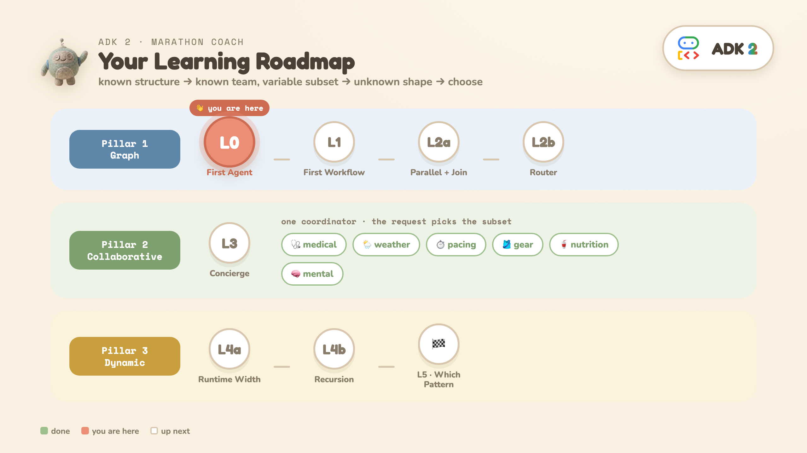
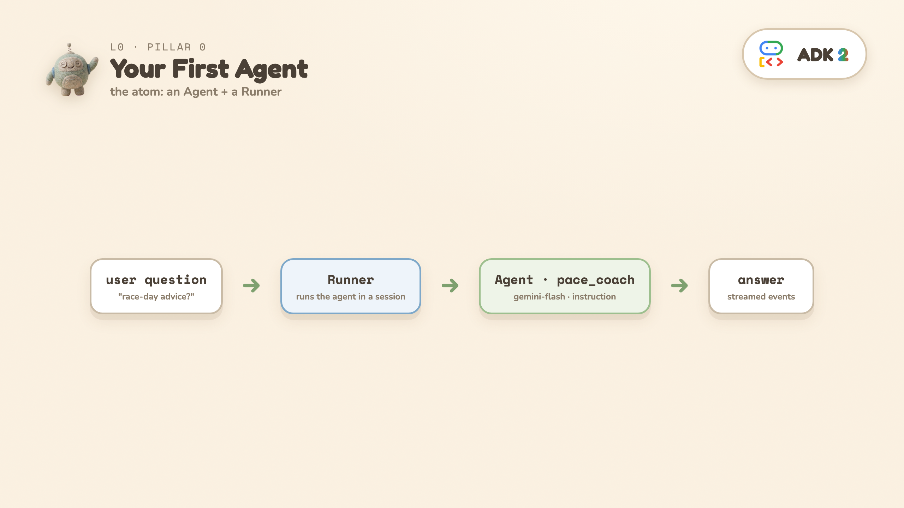
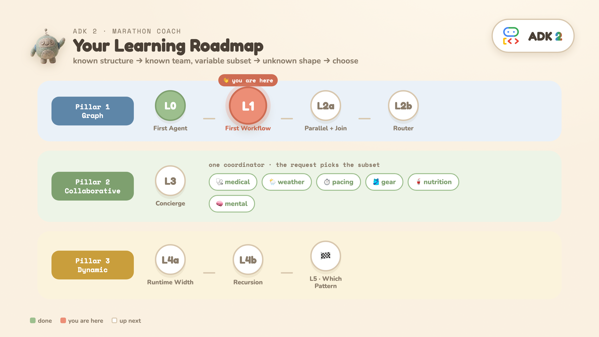
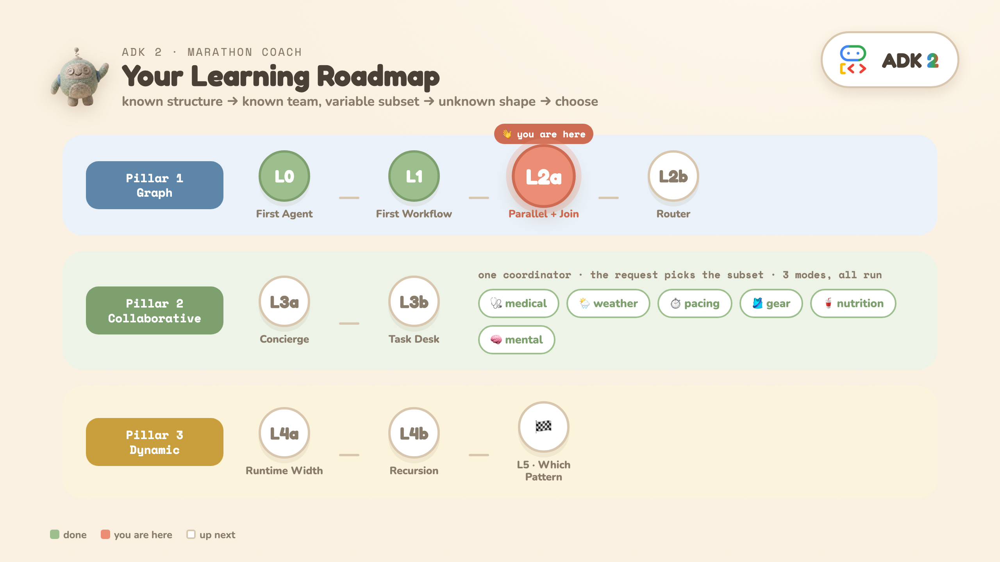
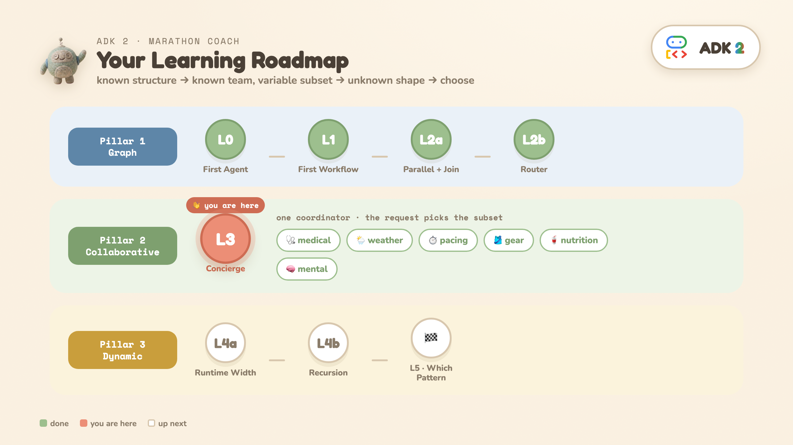
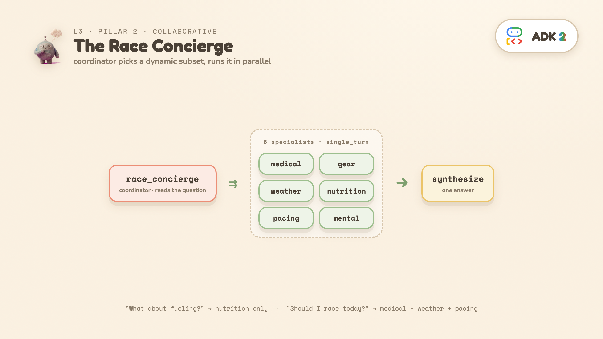
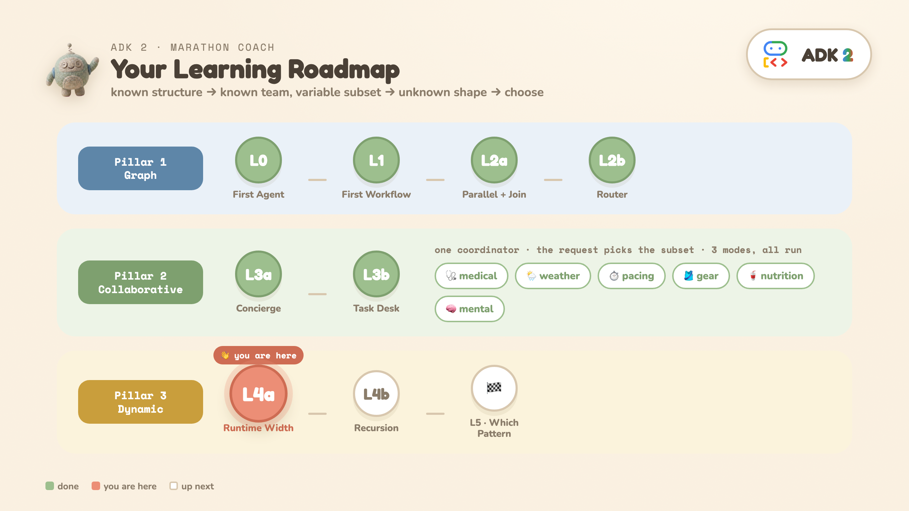
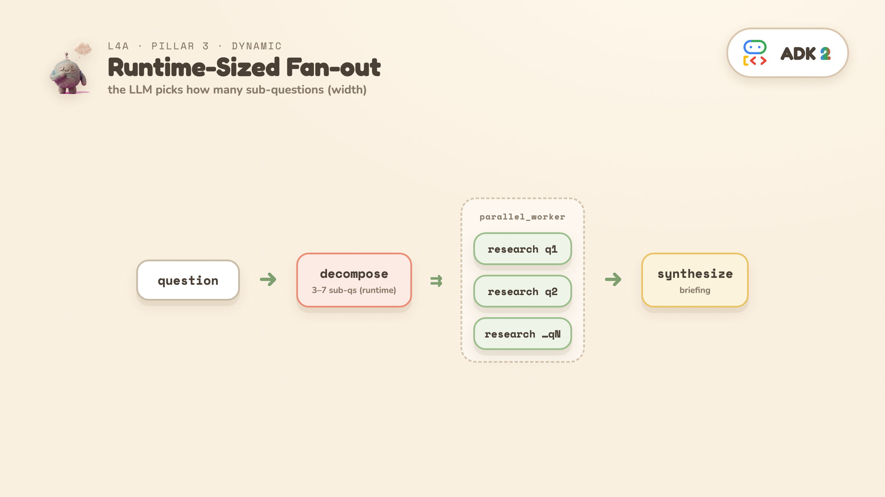
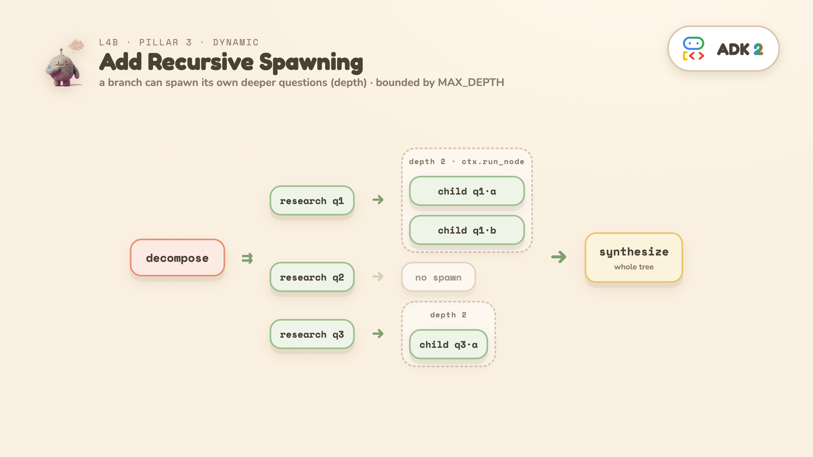
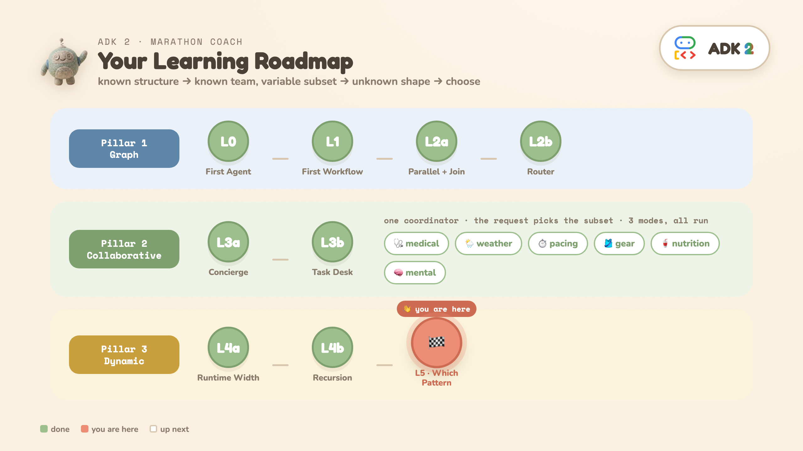

summary: Build a Marathon Race Day Coach and learn ADK 2's three orchestration patterns — graph workflows, collaborative agents, and dynamic workflows — one runnable level at a time.
id: adk2-orchestration
categories: AI, Agents, Google
environments: Web
status: Published
tags: adk, agents, orchestration, gemini
authors: Annie (cuppibla)
feedback link: https://github.com/cuppibla/adk2-tutorial/issues

# ADK 2 Orchestration: Graph, Collaborative & Dynamic Workflows

## Overview
Duration: 3

ADK 2's headline is **three orchestration patterns**. This codelab teaches all three by building one app — a **Marathon Race Day Coach** — one runnable rung at a time. Each level answers a single question, adds one idea, and runs on its own.

### What you'll learn

- **Graph workflows** (Pillar 1) — when you can *draw the flow before the input arrives*.
- **Collaborative agents** (Pillar 2) — when you know the *team* but the *request* picks the subset.
- **Dynamic workflows** (Pillar 3) — when the *shape of the work itself* depends on the input.
- **How to choose** — a one-question decision tree, and how the patterns compose.

### The through-line

> known structure → known team / variable subset → unknown shape → choose the right one



### What you'll build

One app — a **Marathon Race Day Coach** — that shows all three orchestration patterns. Everything runs behind a FastAPI + SSE backend; each level below is one piece of it.


### What you'll need

- A Google account (for Colab) — **no local setup required**.
- A free **Google AI Studio** API key: [aistudio.google.com/app/apikey](https://aistudio.google.com/app/apikey).
- ~30 minutes.

> aside positive
> **The mental model to hold onto:** *Predictable work stays as functions; clear rules become explicit routing; reasoning uses the model.* Every level is a variation on that one sentence.

### Two ways to follow along

Every step below maps to **one cell in the Colab notebook** and **one folder in the GitHub repo**. Pick either:

- **▶ Colab (recommended):** [Open the notebook](https://colab.research.google.com/drive/1sIwliYa6T9tbW23cpRl3zKJw4MJTCIy0) → run cells top to bottom.
- **💻 Local:** `git clone` the [repo](https://github.com/cuppibla/adk2-tutorial), `./setup_venv.sh`, then run each level as a module (`python -m …`) or browse them all with `./run.sh` (`adk web`).

## Setup: open the notebook and add your key
Duration: 4

### Open Colab

Click **[Open in Colab](https://colab.research.google.com/drive/1sIwliYa6T9tbW23cpRl3zKJw4MJTCIy0)**. You'll land on the notebook with a markdown intro and a series of runnable cells.

### Install ADK 2

Run the first code cell. It pins the exact version this codelab was verified on:

```bash
%pip install -q "google-adk==2.3.0" python-dotenv pydantic nest_asyncio
```

> aside negative
> Verified on **2.3.0** (latest stable) and 2.0.0b1 — the graph / collaborative / dynamic APIs are unchanged across the ADK 2 line so far. If a future release breaks them, re-verify.

### Add your Google AI Studio API key

1. Open **[aistudio.google.com/app/apikey](https://aistudio.google.com/app/apikey)** in a new tab, click **Create API key**, and copy it (it starts with `AIza…`).
2. In Colab, click the **🔑 Secrets** icon in the left sidebar → **Add new secret** → name it **`GOOGLE_API_KEY`**, paste the value, and toggle **Notebook access ON**.
3. Run the key cell. It reads the secret (or falls back to a hidden paste prompt), points ADK at **AI Studio** (not Vertex AI), and confirms:

```python
from google.colab import userdata
GOOGLE_API_KEY = userdata.get("GOOGLE_API_KEY")          # or getpass fallback
os.environ["GOOGLE_API_KEY"] = GOOGLE_API_KEY
os.environ["GOOGLE_GENAI_USE_VERTEXAI"] = "False"        # use AI Studio (Gemini API)
# → ✅ API key configured (starts with 'AIzaSy...')
```

> aside positive
> This uses a free **Google AI Studio** key — no Google Cloud project or billing needed. `GOOGLE_GENAI_USE_VERTEXAI=False` keeps ADK on the AI Studio (Gemini API) path.

### Run the "shared building blocks" cell

Run the **Shared building blocks** cell once. It defines the Pydantic schemas and canned marathon scenarios that every later level reuses.

> aside positive
> **Structured I/O** is how ADK 2 moves typed data between function nodes and agents. An agent with `output_schema=RaceStrategy` is *forced* to emit valid JSON for that model; the next node receives it as a typed object.

## L0 · Your first ADK 2 agent
Duration: 3


**The question:** can you get a model to answer, with the minimum ADK moving parts?

**The one idea — two objects:**

- **`Agent`** — the thing that reasons (a Gemini model + an instruction).
- **`Runner`** — the thing that executes an agent inside a session and streams events.

▶ **Colab:** run the [`L0` cell](https://colab.research.google.com/drive/1sIwliYa6T9tbW23cpRl3zKJw4MJTCIy0#scrollTo=L0) · 📁 **GitHub:** [`L0_first_agent/`](https://github.com/cuppibla/adk2-tutorial/tree/main/L0_first_agent) · 💻 **Local:** `python -m L0_first_agent.agent`



```python
pace_coach = Agent(
    name="pace_coach", model=MODEL,
    instruction="You are a friendly, concise marathon coach. Answer in 3-4 sentences.",
)
runner = Runner(node=pace_coach, session_service=InMemorySessionService(), auto_create_session=True)
async for event in runner.run_async(user_id="u1", session_id="s1", new_message=msg):
    ...  # events carry the model's text
```

**What you'll see:** the coach answers your question in a few sentences. That's the whole program — one `Agent`, one `Runner`, one `run_async` loop.

> aside positive
> Everything else in this codelab is just *more agents, arranged in more interesting shapes*. This is the atom.

## L1 · Your first Workflow
Duration: 4



**The question:** how do you mix plain code and an LLM in one flow, without paying for a model call on the parts that are just code?

**The one idea:** in a `Workflow`, a **plain Python function and an LLM agent are both just nodes** in the same `edges` list.

```
START ──► fetch_conditions (function, 0 LLM) ──► advise (agent, 1 LLM)
```

▶ **Colab:** run the [`L1` cell](https://colab.research.google.com/drive/1sIwliYa6T9tbW23cpRl3zKJw4MJTCIy0#scrollTo=L1) · 📁 **GitHub:** [`L1_graph_basics/`](https://github.com/cuppibla/adk2-tutorial/tree/main/L1_graph_basics) · 💻 **Local:** `python -m L1_graph_basics.workflow`


The function node prints the data it produced (no model call), then the agent gives advice that references the actual temperature and wind it received:

```python
def fetch_conditions(node_input):                # function node — 0 LLM
    return Event(output=Conditions(temp_f=78, wind_mph=12, conditions="sunny").model_dump())

advise = Agent(name="advise", model=MODEL, mode="single_turn",
               input_schema=Conditions, instruction="...give pacing + gear advice...")

l1_workflow = Workflow(edges=[(START, fetch_conditions, advise)])
```

**What's new vs L0:** `Workflow(edges=[...])`, `START` (where input enters), a function node returning `Event(output=...)`, and `input_schema=Conditions` so the agent receives the function's output as a typed object.

## L2a · Parallel fan-out + JoinNode (Pillar 1a)
Duration: 4



**The question:** you can *draw the flow before the input arrives*. Start with the skeleton: gather data in parallel, bundle it, hand it to one agent.

**The shape:**

```
START ──► fetch_weather ──┐
START ──► analyze_course ─┼─► JoinNode ─► strategy (1 agent)
START ──► pull_fitness ───┘   (bundles)
```

▶ **Colab:** run the [`L2a` cell](https://colab.research.google.com/drive/1sIwliYa6T9tbW23cpRl3zKJw4MJTCIy0#scrollTo=L2a) · 📁 **GitHub:** [`L2a_parallel_join/`](https://github.com/cuppibla/adk2-tutorial/tree/main/L2a_parallel_join) · 💻 **Local:** `python -m L2a_parallel_join.workflow`


- The three fetches are **functions** — they run **in parallel**, 0 LLM calls.
- **`JoinNode`** waits for all three and bundles them into one typed payload (`BundledRunData`), keyed by function name.
- One `strategy` agent reads the bundle and writes a `RaceStrategy`.

**What you'll see:** the strategy cites real numbers, and the wall time is near the *slowest* fetch (~2s) rather than the sum (~4.5s) — because the fetches ran concurrently.

> aside positive
> **Uniquely ADK 2:** function nodes and an agent node are peers in one `edges` list. In 1.x every node is an agent, so each fetch needs its own model call.

## L2b · Add the deterministic router (Pillar 1b)
Duration: 4


**The question:** the plan should differ for hot vs cold weather. How do you branch — *without* asking the model to decide?

**The shape (L2a + a router):**

```
… JoinNode ─► route_by_weather ─► hot_strategy
               (if-statement)   ─► normal_strategy
                                ─► cold_strategy
```

▶ **Colab:** run the [`L2b` cell](https://colab.research.google.com/drive/1sIwliYa6T9tbW23cpRl3zKJw4MJTCIy0#scrollTo=L2b) — try `run("NORMAL")` / `run("COLD")` · 📁 **GitHub:** [`L2b_router/`](https://github.com/cuppibla/adk2-tutorial/tree/main/L2b_router) · 💻 **Local:** `python -m L2b_router.workflow COLD`


```python
def route_by_weather(node_input):                        # an if-statement, 0 LLM
    temp = node_input["fetch_weather"]["temp_f"]
    route = "HOT" if temp >= 70 else "COLD" if temp <= 40 else "NORMAL"
    return Event(output=node_input, route=route)

(route_by_weather, {"HOT": hot_strategy, "NORMAL": normal_strategy, "COLD": cold_strategy})
```

**The takeaway — three kinds of work, three homes:**

- Predictable work → **functions** (the 3 parallel fetches)
- A clear rule → **explicit routing** (`route_by_weather` is an `if`-statement, not a model decision)
- Reasoning → **the model** (exactly **one** strategy agent runs)

**What you'll see:** `temp=78F -> route=HOT`, then a structured `RaceStrategy`. **Net cost: 1 LLM call.**

> aside positive
> The ADK 1.x way makes every node an agent, so each fetch needs its own model call — **4 calls** instead of this pattern's **1**.

## L3 · Collaborative agents — Pillar 2
Duration: 5



**The question:** you know the **team**, but the **request** decides which members should answer. How do you let an LLM pick the subset — and run them concurrently?

**The shape:** a coordinator over six `single_turn` specialists (medical, weather, pacing, gear, nutrition, mental). The coordinator reads the question, picks the relevant subset, ADK runs them **in parallel**, then synthesizes one answer.

| Question | Specialists that fire |
| --- | --- |
| "What about fueling?" | nutrition only |
| "My knee hurts at mile 18" | medical only |
| "Should I race today?" | medical + weather + pacing |
| "Anything I should worry about?" | all 6 |

▶ **Colab:** run the [`L3` cell](https://colab.research.google.com/drive/1sIwliYa6T9tbW23cpRl3zKJw4MJTCIy0#scrollTo=L3) · 📁 **GitHub:** [`L3_collaborative/`](https://github.com/cuppibla/adk2-tutorial/tree/main/L3_collaborative) · 💻 **Local:** `python -m L3_collaborative.concierge "Should I race today?"`



Run it, then change the question and re-run. **The contrast between two questions is the lesson.**

```python
race_concierge = Agent(name="race_concierge", model=MODEL,
                       sub_agents=[medical, weather, pacing, gear, nutrition, mental],
                       instruction="...DECIDE which specialists are relevant... call them IN PARALLEL... SYNTHESIZE...")
```

**What you'll see:** `DISPATCH -> medical_specialist` lines revealing the chosen subset, then one synthesized answer.

> aside positive
> **Uniquely ADK 2:** an LLM picks a **per-request subset** AND runs it in parallel. In 1.x, `ParallelAgent` is always-all and `transfer_to_agent` is serial — neither does dynamic-subset-in-parallel.

> aside negative
> Two honest caveats: (1) the model picks the subset, so it's **less deterministic** than L2's hard-coded router — the exact subset can vary run to run. (2) Occasionally a specialist returns prose instead of clean JSON and you'll see a schema-validation warning in the logs — the coordinator recovers and still synthesizes.

## L4a · Runtime-sized parallel fan-out (Pillar 3a)
Duration: 5



**The question:** the *shape* of the work depends on the input. You can't draw the graph ahead of time. Start with runtime **width**: let the LLM decide *how many* sub-questions.

**The shape (one level deep):**

```
START ─► decompose ─► research_topic (parallel_worker) ─► synthesize
                             │  │  │
                             └──┴──┴─ (flat: no children yet)
```

An open-ended question is **decomposed** into N sub-questions — **N is chosen by the LLM at runtime** (3–7) — each **researched in parallel**, then **synthesized** into one briefing.

> aside negative
> This cell makes **~7–9 live LLM calls** and takes **~20–30s**. It costs real API quota.

▶ **Colab:** run the [`L4a` cell](https://colab.research.google.com/drive/1sIwliYa6T9tbW23cpRl3zKJw4MJTCIy0#scrollTo=L4a) · 📁 **GitHub:** [`L4a_flat_research/`](https://github.com/cuppibla/adk2-tutorial/tree/main/L4a_flat_research) · 💻 **Local:** `python -m L4a_flat_research.deep_research`



**What you'll see:** the decomposer prints e.g. 5 sub-questions, they research in parallel, then a synthesized briefing. The *number* differs on every run — the fixed graph couldn't do that.

> aside positive
> **Uniquely ADK 2 (so far):** `@node(parallel_worker=True)` fans one worker across a **runtime-sized** list. A 1.x `ParallelAgent` needs a fixed list known at build time.

## L4b · Add recursive spawning (Pillar 3b)
Duration: 5


**The question:** one research finding sometimes surfaces a narrow sub-topic worth its own investigation. How do you let a branch **spawn more parallel work** — and keep it bounded?

**The shape (now recursive):**

```
START ─► decompose ─► research_topic (parallel_worker, recursive) ─► synthesize
                             │  │  │
                             │  │  └─ research(q3) ─► maybe spawn children
                             │  └─── research(q2) ─► maybe spawn children
                             └────── research(q1) ─► maybe spawn children
```

> aside negative
> This cell makes **~10–17 live LLM calls** and takes **20–45s**. Run it deliberately.

▶ **Colab:** run the [`L4b` cell](https://colab.research.google.com/drive/1sIwliYa6T9tbW23cpRl3zKJw4MJTCIy0#scrollTo=L4b) · 📁 **GitHub:** [`L4b_recursion/`](https://github.com/cuppibla/adk2-tutorial/tree/main/L4b_recursion) · 💻 **Local:** `python -m L4b_recursion.deep_research`



```python
@node(parallel_worker=True, rerun_on_resume=True)
async def research_topic(ctx, node_input):
    finding = coerce(await ctx.run_node(research_agent, node_input=...), ResearchFinding)
    if finding.needs_deeper and finding.deeper_questions and depth < MAX_DEPTH:   # boundary in CODE
        children = await ctx.run_node(research_topic, node_input=deeper)          # recursive fan-out
    yield Event(output={..., "children": children})
```

**What you'll see:** research nodes printing `spawning N deeper` — recursion happening live — then a runtime tree shape (e.g. `5 top-level + 10 recursive children`). The tree differs on every run.

> aside positive
> **Uniquely ADK 2:** runtime-sized *and* runtime-deep parallel fan-out with recursive `ctx.run_node`, all **inside the framework** — you keep tracing, checkpointing, and resumability. In 1.x, real recursion forces you out to raw `asyncio` and you lose all of it.

> aside positive
> **The rule:** *let the LLM shape the work, but keep the boundaries in code.* `MAX_DEPTH = 2` means depth-2 children cannot spawn — there is no depth 3. Width is bounded too (3–7 sub-questions).

## L5 · Which pattern should you use?
Duration: 3



You've built all three. This is the model that makes them useful: **match the pattern to the shape of your problem.**

```
Can you draw the workflow before the input arrives?
│
├─ YES ─────────────────────────────► Pillar 1 · Graph workflow      (L2a/L2b)
│
└─ NO
   ├─ Known team, request picks the subset? ─► Pillar 2 · Collaborative  (L3)
   └─ Does the shape depend on the input?  ──► Pillar 3 · Dynamic         (L4a/L4b)
```


### The honest 1.x-vs-2 framing

This is **not** "2.0 can do things 1.x couldn't" — 1.x could build all of it. The shift is that **2.0 gives each shape a more direct home**, so known control flow leaves the prompt and becomes structure you can see and test.

| Pattern | The 1.x cost | The ADK 2 home |
| --- | --- | --- |
| **Graph** | 4 LLM calls; routing hidden in a prompt | function + agent nodes as peers → 1 call, `if`-statement router |
| **Collaborative** | always-all or serial delegation | per-request subset, run in parallel |
| **Dynamic** | recursion drops you out of the framework | `parallel_worker` + recursive `ctx.run_node` inside the framework |

### They compose

The three patterns are **not mutually exclusive**. A graph node can call a collaborative coordinator; a specialist can launch a dynamic workflow. Choose the right pattern per *part* of the problem — that's how you avoid turning every agent system into one giant prompt.

## Congratulations
Duration: 1

You built a Marathon Race Day Coach and, along the way, all three of ADK 2's orchestration patterns.

### What you learned

- **L0–L1** — `Agent`, `Runner`, and your first `Workflow` (function nodes + agent nodes as peers).
- **L2a / L2b** — graph workflows: parallel fan-out + `JoinNode`, then deterministic routing — one LLM call.
- **L3** — collaborative agents: an LLM-chosen subset of specialists, run in parallel.
- **L4a / L4b** — dynamic workflows: runtime width (fan-out), then runtime depth (recursion) with boundaries in code.
- **L5** — the decision tree, and how the patterns compose.

### Lines worth keeping

> *Functions prepare the context. Edges define the workflow. The router chooses the path. The model writes the answer.*
>
> *Let the LLM shape the work, but keep the boundaries in code.*
>
> *Match the pattern to the shape of your problem.*

### Next steps

- Run the full app these levels were distilled from — the **Marathon Race Day Coach** (FastAPI + SSE + a browser UI showing all three modes live).
- Port your **own** problem: which parts are known-structure (L2), known-team (L3), unknown-shape (L4)?
- Explore the code: [github.com/cuppibla/adk2-tutorial](https://github.com/cuppibla/adk2-tutorial).
