# Build with ADK 2 Orchestration Patterns

## adk2001

![[/fragments/labmanuallogo]]

## Overview

ADK 2's headline is **three orchestration patterns**. This lab teaches all three by building one app — a **Marathon Race Day Coach** — one runnable rung at a time. Each level answers a single question, adds one idea, and runs on its own.

### What you'll learn

- **Graph workflows** (Pillar 1) — when you can *draw the flow before the input arrives*.
- **Collaborative agents** (Pillar 2) — when you know the *team* but the *request* picks the subset — and all **three collaboration modes** (`chat` / `task` / `single_turn`), each run live.
- **Dynamic workflows** (Pillar 3) — when the *shape of the work itself* depends on the input.
- **How to choose** — a one-question decision tree, and how the patterns compose.

### The through-line

> known structure → known team / variable subset → unknown shape → choose the right one

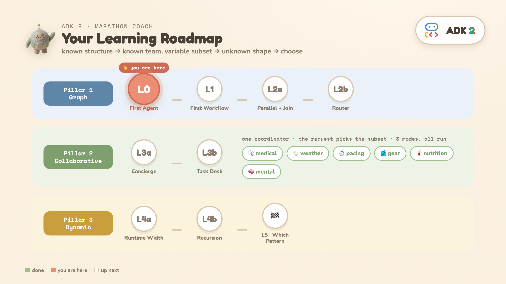

### What you'll build

One app — a **Marathon Race Day Coach** — that shows all three orchestration patterns. Everything runs behind a FastAPI + SSE backend; each level below is one piece of it.

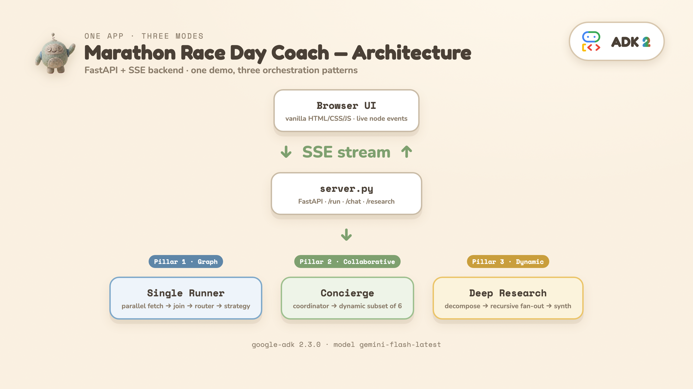

### What you'll need

- Just this lab — it provisions a **temporary Google Cloud project** for you.
- No personal API key, no local install: everything runs in **Cloud Shell**.
- ~55 minutes (the two L4 levels are the long ones — budget them).


<ql-infobox>
<strong>Tip:</strong> <b>The mental model to hold onto:</b> <i>Predictable work stays as functions; clear rules become explicit routing; reasoning uses the model.</i> Every level is a variation on that one sentence.
</ql-infobox>

## Google Cloud setup

![[/fragments/startqwiklab]]

![[/fragments/gcpconsole]]

![[/fragments/cloudshell]]

### Configure your environment

This lab created a project for you when you pressed **Start Lab**, assigned a region, and enabled the Vertex AI API in the background — there is nothing to enable by hand.

1. Note your assigned values:
   - **Project ID:** <ql-variable key="project_0.project_id" placeHolder="PROJECT"></ql-variable>
   - **Region:** <ql-variable key="project_0.default_region" placeHolder="REGION"></ql-variable>

2. In Cloud Shell, configure them in your environment:
   <ql-code-block bash templated noWrap>
   export GOOGLE_GENAI_USE_VERTEXAI=True
   export GOOGLE_CLOUD_PROJECT="{{{project_0.project_id | "PROJECT_ID"}}}"
   export GOOGLE_CLOUD_LOCATION="{{{project_0.default_region | "REGION"}}}"
   export ADK_MODEL=gemini-2.5-flash
   gcloud config set project $GOOGLE_CLOUD_PROJECT
   </ql-code-block>

## Task 1. Prepare your environment

In this task, you clone the tutorial repository, set up a Python virtual environment, and install the required libraries.

1. In Cloud Shell, clone the tutorial repository and enter it:

<ql-code-block language="bash">
git clone https://github.com/cuppibla/adk2-tutorial.git
cd adk2-tutorial
</ql-code-block>

2. Create and activate a Python virtual environment:

<ql-code-block language="bash">
python3 -m venv venv
source venv/bin/activate
</ql-code-block>

3. Install the required Python packages:

<ql-code-block language="bash">
pip install -q "google-adk==2.3.0" python-dotenv pydantic nest_asyncio
</ql-code-block>

## Task 2. Prologue · Why not one big prompt?

**⚡ Before you run it, lock in the ONE thing to watch: where does every specific number come from?** That's the entire exercise — everything else is decoration.

Before the ladder, run the thing the ladder replaces: **one agent whose prompt promises everything** — fetch the weather, analyze the course, read the training log, route by conditions, output the plan.

**What you'll see:** a confident, specific, well-formatted strategy… whose numbers are **invented**. In one live run it opened with *"I have pulled today's weather metrics"* and reported 52°F, a 9 mph wind, and an analysis of a training log it has never seen. There is no weather API here, no course data, no log — one opaque model call either fabricates its inputs or hedges them into uselessness.

That's the disease, and it has four symptoms worth naming:

1. **You can't trust it** — the data is made up, fluently.
2. **You can't test it** — step 4's routing lives inside prose; there's no `if` to unit-test.
3. **You can't swap a step** — no seam where a real weather API could plug in.
4. **You pay for everything, every time** — five steps, one giant call, no caching a deterministic part.

Hold that feeling. The next nine levels take those steps **out of the prompt, one at a time**: functions fetch (L1–L2a), an `if`-statement routes (L2b), specialists divide the work (L3a–L3b), and code bounds the shape (L4a–L4b).


### Run it

In Cloud Shell, from the `adk2-tutorial` directory:

<ql-code-block language="bash">
python -m shared.prologue
</ql-code-block>

## Task 3. L0 · Your first ADK 2 agent


**⚡ TL;DR:** an agent is a model + an instruction + **tools it may call**; a `Runner` executes it. Everything after this level is just more agents, arranged in better shapes.

**The question:** can you get a model to answer — and to reach for **real code** when arithmetic matters?

**The one idea — three parts:**

- **`Agent`** — the thing that reasons (a Gemini model + an instruction).
- **`Runner`** — the thing that executes an agent inside a session and streams events.
- **a tool** — a plain Python function (`pace_splits`) the **model decides** to call. ADK reads the signature + docstring and hands the model a declaration; no schema-writing.

After the prologue this is the first repair: an LLM doing pace arithmetic in its head will happily be wrong — `pace_splits` is deterministic Python, so the numbers in the answer are **computed, not improvised**.

### Run it

In Cloud Shell, from the `adk2-tutorial` directory:

<ql-code-block language="bash">
python -m L0_first_agent.agent
</ql-code-block>

<ql-code-block language="bash">
python -m L0_first_agent.agent "What is the most common mistake first-time marathoners make?"
</ql-code-block>


<ql-code-block language="python">
def pace_splits(target_finish: str) -> dict:
    """Convert a goal time like '3:30:00' into exact per-mile / per-km paces."""
    ...                                  # deterministic Python — no LLM

pace_coach = Agent(
    name="pace_coach", model=MODEL,
    tools=[pace_splits],                 # the model may call it; ADK reads the signature
    instruction="You are a friendly, concise marathon coach. ... If the runner "
                "mentions a goal time, call pace_splits — never do arithmetic yourself.",
)
runner = Runner(node=pace_coach, session_service=InMemorySessionService(), auto_create_session=True)
async for event in runner.run_async(user_id="u1", session_id="s1", new_message=msg):
    ...  # events carry the model's text
</ql-code-block>

> 🔍 **The markers:** `Agent(...)` · `tools=[pace_splits]` · `Runner(...)`. And in the output, the `🔧` line — that's the **model deciding**, mid-answer, to call your code.

**What you'll see:**

```
   🔧 model called tool → pace_splits({'target_finish': '3:30:00'})
   🔧 tool returned     → {'per_mile': '8:00', 'per_km': '4:58', ...}
🧠 Coach: To finish in 3:30:00, you need an average pace of 8:00 per mile…
```

The 🔧 lines are the lesson: mid-answer, the **model chose** to call your function, and the exact `8:00/mile` in its reply came from your code — not from token statistics.

<ql-infobox>
<strong>Tip:</strong> Everything else in this lab is just <i>more agents, arranged in more interesting shapes</i>. This is the atom.
</ql-infobox>

> ❓ **You might be wondering:** *does the model always call the tool?* No — it decides, per question. Ask something with no numbers in it and the 🔧 lines vanish (the ✏️ Change step below has you try exactly this).

> 👀 **Read:** `pace_splits` (a plain function) and the `tools=[pace_splits]` line. · ▶ **Run** it. · ✏️ **Change:** ask the *general* question (no goal time) — notice the 🔧 lines disappear: **the model decides** when a tool is worth calling. Then rewrite the `instruction` and re-run — the instruction is the rest of the program.

## Task 4. L1 · Your first Workflow

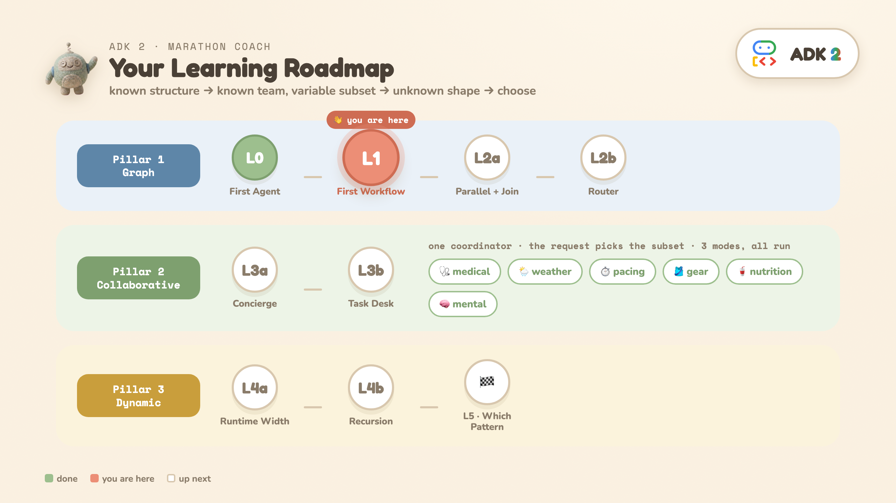

**⚡ TL;DR:** a plain function and an LLM agent are the **same kind of node**. Predictable work → function (0 LLM, deterministic); reasoning → agent.

**The question:** how do you mix plain code and an LLM in one flow, without paying for a model call on the parts that are just code?

**The one idea:** in a `Workflow`, a **plain Python function and an LLM agent are both just nodes** in the same `edges` list.

```
START ──► fetch_conditions (function, 0 LLM) ──► advise (agent, 1 LLM)
```

### Run it

In Cloud Shell, from the `adk2-tutorial` directory:

<ql-code-block language="bash">
python -m L1_graph_basics.workflow
</ql-code-block>

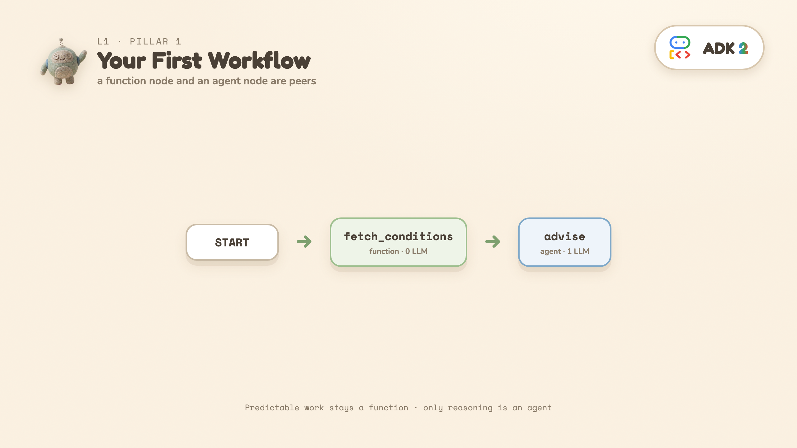

The function node prints the data it produced (no model call), then the agent gives advice that references the actual temperature and wind it received:

<ql-code-block language="python">
def fetch_conditions(node_input):                # function node — 0 LLM
    return Event(output=Conditions(temp_f=78, wind_mph=12, conditions="sunny").model_dump())

advise = Agent(name="advise", model=MODEL, mode="single_turn",
               input_schema=Conditions, instruction="...give pacing + gear advice...")

workflow = Workflow(edges=[(START, fetch_conditions, advise)])
</ql-code-block>

> 🔍 **The markers:** one edge tuple — `(START, fetch_conditions, advise)` — with a bare Python function sitting in the middle of it, and `input_schema=` validating the hand-off.

**What's new vs L0:** `Workflow(edges=[...])`, `START` (where input enters), a function node returning `Event(output=...)`, and `input_schema=Conditions` so the function's output is validated against that schema before the agent sees it (as JSON text — `input_schema` validates the boundary, it does not hand the agent a Python object).

> ❓ **You might be wondering:** *is function-then-agent the required order?* No — any order, any mix, any count. `advise` runs second only because it needs `fetch_conditions`' data. The lesson is the peerage, not the sequence.

> 👀 **Read:** `fetch_conditions` returns data with **no model call**; `advise` has `input_schema=Conditions`. · ▶ **Run** it. · ✏️ **Change:** set `temp_f=30` in the function and re-run — the advice flips, and the function still cost 0 LLM calls.

## Task 5. L2a · Parallel fan-out + JoinNode (Pillar 1a)


**⚡ TL;DR:** fan out in parallel (free), wait for **all**, bundle, hand one agent the complete picture.

**The question:** you can *draw the flow before the input arrives*. Start with the skeleton: gather data in parallel, bundle it, hand it to one agent.

**The shape:**

```
START ──► fetch_weather ──┐
START ──► analyze_course ─┼─► JoinNode ─► strategy (1 agent)
START ──► pull_fitness ───┘   (bundles)
```

### Run it

In Cloud Shell, from the `adk2-tutorial` directory:

<ql-code-block language="bash">
python -m L2a_parallel_join.workflow HOT
</ql-code-block>

<ql-code-block language="bash">
python -m L2a_parallel_join.workflow COLD
</ql-code-block>

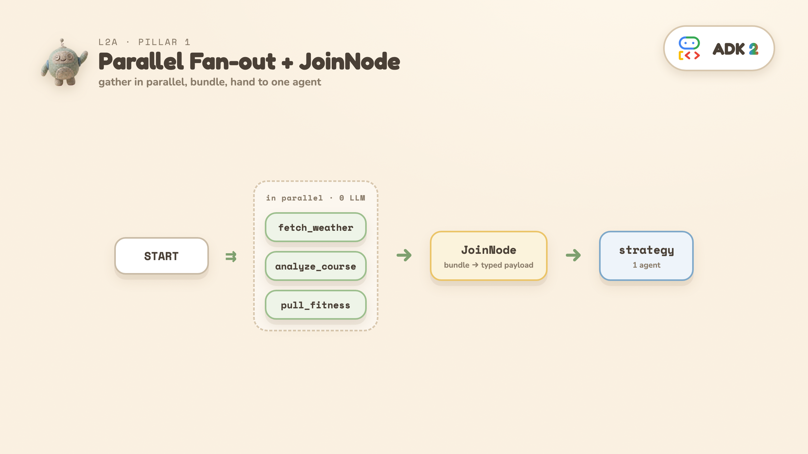

> 🔍 **The markers:** three edges that all start at `START` — that *is* the fan-out — and `JoinNode`, the meeting point.

- The three fetches are **functions** — they run **in parallel**, 0 LLM calls.
- **`JoinNode`** waits for all three and bundles them into one typed payload (`BundledRunData`), keyed by function name.
- One `strategy` agent reads the bundle and writes a `RaceStrategy`.

**What you'll see:** each fetch prints a `started` / `finished` timestamp. All three start at **0.0s** and the fan-out ends at **2.0s** — the slowest fetch, not the **4.5s** their durations would sum to. That overlap is the parallelism. (The *total* wall time printed at the end is ~8s because it also contains the strategy agent's LLM call — read the fetch timestamps for the parallel claim, not the total.)

<ql-infobox>
<strong>Tip:</strong> <b>Where ADK 2 gives this a direct home:</b> function nodes and an agent node are peers in one <code>edges</code> list. 1.x could keep steps out of the model too — via a custom <code>BaseAgent</code> subclass — but that meant writing the orchestration plumbing yourself, so most builds wrapped each step as an agent.
</ql-infobox>

> 💡 **Prologue callback:** the mega-prompt *invented* its weather. Here the temperature comes out of a fetch **function** — real code, real seam. Swap the canned dict for an actual weather API and nothing else changes.

> ❓ **You might be wondering:** *how much `JoinNode` do I need to understand?* One sentence: it waits until every parallel branch lands, packs the outputs into **one dict keyed by the upstream function's name**, and computes nothing itself. That dict is exactly why L2b's router can write `node_input["fetch_weather"]["temp_f"]`.

> 👀 **Read:** three edges fan out from `START`; `JoinNode` bundles them for one agent. · ▶ **Run** it and read the *timestamps*, not the total. · ✏️ **Change:** make one fetch sleep `3.0` — predict the new fan-out end time first, then verify.

## Task 6. L2b · Add the deterministic router (Pillar 1b)

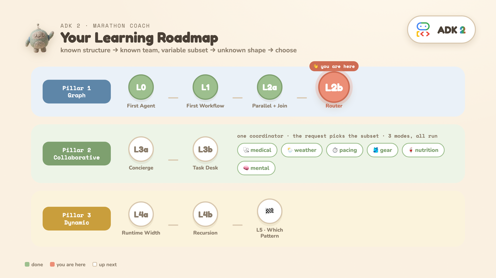

**⚡ TL;DR:** L2a untouched + a plain `if` decides which **one** agent runs. Branching, without asking the model.

**The question:** the plan should differ for hot vs cold weather. How do you branch — *without* asking the model to decide?

**The shape (L2a + a router):**

```
… JoinNode ─► route_by_weather ─► hot_strategy
               (if-statement)   ─► normal_strategy
                                ─► cold_strategy
```

### Run it

In Cloud Shell, from the `adk2-tutorial` directory:

<ql-code-block language="bash">
python -m L2b_router.workflow HOT
</ql-code-block>

<ql-code-block language="bash">
python -m L2b_router.workflow COLD
</ql-code-block>

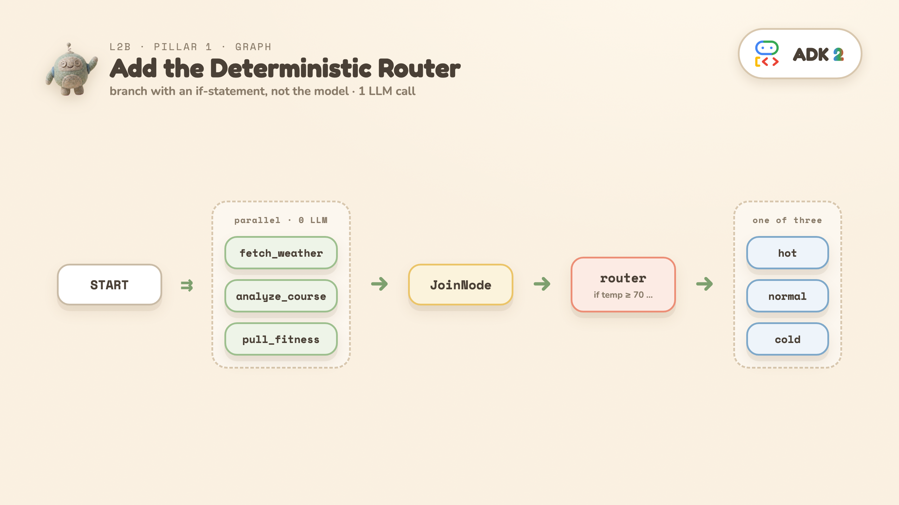

<ql-code-block language="python">
def route_by_weather(node_input):                        # an if-statement, 0 LLM
    temp = node_input["fetch_weather"]["temp_f"]
    route = "HOT" if temp >= 70 else "COLD" if temp <= 40 else "NORMAL"
    return Event(output=node_input, route=route)

(route_by_weather, {"HOT": hot_strategy, "NORMAL": normal_strategy, "COLD": cold_strategy})
</ql-code-block>

> 🔍 **The markers:** `Event(output=…, route=…)` — a function node *naming* the path — and the dict-edge `{"HOT": …, "NORMAL": …, "COLD": …}` that maps names to nodes.

**The takeaway — three kinds of work, three homes:**

- Predictable work → **functions** (the 3 parallel fetches)
- A clear rule → **explicit routing** (`route_by_weather` is an `if`-statement, not a model decision)
- Reasoning → **the model** (exactly **one** strategy agent runs)

**What you'll see:** `temp=78F -> route=HOT`, then a structured `RaceStrategy`. **Net cost: 1 LLM call.**

<ql-infobox>
<strong>Tip:</strong> The common 1.x build wrapped each step as an agent — <b>4 calls</b> instead of this pattern's <b>1</b>. (A custom <code>BaseAgent</code> subclass could reach 1 call in 1.x as well; it just wasn't first-class, so few builds did it.)
</ql-infobox>

> ⚠️ **If you add a fourth branch,** give the route-dict a `DEFAULT_ROUTE` entry too. A route the dict doesn't match isn't an error — the branch simply ends, and the program exits **0 with no output**, which is a confusing dead end to debug.

> ❓ **You might be wondering:** *so L2b is literally L2a plus a router?* Yes — the fetches and the join are untouched, and it's still exactly **1 LLM call**. What changed: "always the same agent" became "one of three, chosen by data".

> 👀 **Read:** `route_by_weather` — the router is an `if`-statement, not an agent. · ▶ **Run** `run("COLD")` too. · ✏️ **Change:** add a `WINDY` branch with a fourth agent — and read the `DEFAULT_ROUTE` warning above *before* you do.

## Task 7. L3a · Collaborative agents: one flag, two worlds — Pillar 2

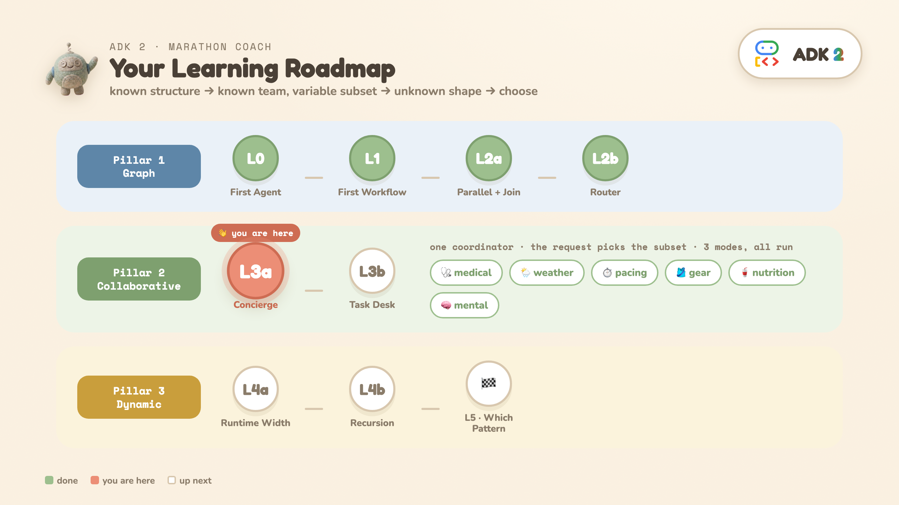

**⚡ TL;DR:** same team, one flag. `chat` hands the **whole conversation** to one specialist and never comes back; `single_turn` turns each specialist into a **tool** — parallel subset, auto-return, one synthesis.

**The question:** you know the **team**, but the **request** decides which members should answer. How do you let an LLM pick the subset — and run them concurrently?

**The shape:** a coordinator over six specialists (medical, weather, pacing, gear, nutrition, mental). This level runs the **same team twice** — same coordinator prompt, same six specialists. The only difference is one flag on the subagents. **The contrast is the lesson.**

### Run it

In Cloud Shell, from the `adk2-tutorial` directory:

<ql-code-block language="bash">
python -m L3a_collaborative.concierge --mode chat "What about fueling?"
</ql-code-block>

<ql-code-block language="bash">
python -m L3a_collaborative.concierge "Should I race today?"
</ql-code-block>

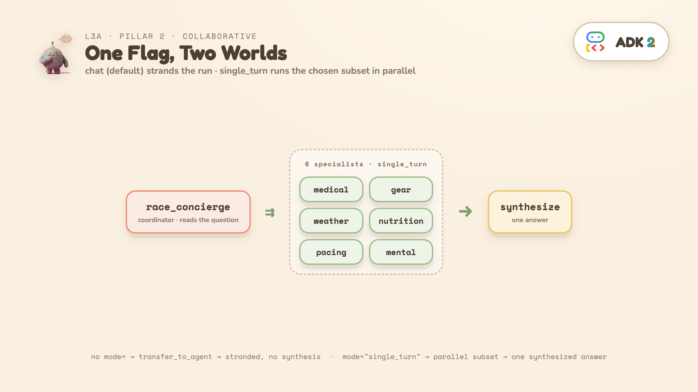

> 🔍 **The markers:** `mode="single_turn"` in the factory — and in the *output*, `TRANSFER →` (beat 1) versus a burst of `DISPATCH →` lines sharing one timestamp (beat 2).

### Beat 1 · Run the default first — and watch it fail the job

No `mode=` written → subagents default to **`chat`**. What you'll see:

```
TRANSFER → nutrition_specialist   (transfer_to_agent — the only tool chat subagents provide)
Final speaker: nutrition_specialist
```

The coordinator got **no delegation tools** — chat subagents only give it `transfer_to_agent`, a serial handoff of the *whole conversation* to **one** specialist. That specialist answers the user directly, and the run ends there. No parallel dispatch. No return. No synthesis. Ask the broad question and it gets worse: six specialists, one transfer.

That's not a bug — it's chat mode doing its job. The conversation *belongs* to whoever holds it, until someone explicitly transfers away. Right for an open-ended assistant; wrong for a pipeline step.

### Beat 2 · One flag, two worlds

The only diff: `mode="single_turn"` on each specialist. Same question, run again:

```
[t= 7.8s] DISPATCH → medical_specialist      ← same timestamp =
[t= 7.8s] DISPATCH → weather_specialist         one turn, many calls
[t=14.5s]   ↩ medical_specialist replied     ← replies land inside
[t=14.5s]   ↩ weather_specialist replied        one short window
🧠 Concierge (synthesized): <one answer>
```

Now ADK injects **one delegation tool per specialist** — named after the subagent, described by its `description=` (that text is what the coordinator reads when choosing the subset; skip it and you're routing on names alone). The coordinator emits several calls in one turn, ADK runs them **in parallel**, each auto-returns its result, and the coordinator synthesizes.

| Question | Specialists that fire |
| --- | --- |
| "What about fueling?" | nutrition only |
| "My knee hurts at mile 18" | medical only |
| "Should I race today?" | medical + weather + pacing |
| "Anything I should worry about?" | all 6 |

**Why each specialist gets handed the whole briefing:** each `single_turn` subagent runs in its **own isolated session branch** — it cannot see the conversation or its peers. Nothing is ambient: the coordinator must forward the *entire* `SpecialistInput` (question + strategy + runner data) separately into every parallel call.

> 💡 **Where ADK 2 gives this a direct home:** an LLM picks a **per-request subset** AND runs it in parallel — *declared* via `sub_agents` + `mode="single_turn"`. You could assemble the same shape in 1.x by wrapping each specialist in `AgentTool`; what changes is that it is now a declaration rather than plumbing. (`ParallelAgent` is always-all and `transfer_to_agent` is serial.)

> ⚠️ Two honest caveats: (1) the model picks the subset, so it's **less deterministic** than L2's hard-coded router — the exact subset can vary run to run. (2) Occasionally you'll see an `Error validating input: ...` line for one specialist. It is almost never the specialist's *output* — `output_schema` makes Gemini enforce that server-side. It's the **input**: the coordinator has to reproduce the whole nested `SpecialistInput` verbatim for every parallel call, and sometimes it fumbles one. ADK returns the error as that tool's result, the coordinator recovers, and the synthesis still lands.

> ❓ **You might be wondering:** *is `chat` just 1.x-style delegation — one agent at a time?* Essentially yes: it's the 1.x default behavior, now with a name. The gap to `single_turn` is three-dimensional: what the coordinator holds (one `transfer_to_agent` vs one tool **per specialist**) · how many can work (one, owning the conversation vs N in parallel) · whether control returns (never vs automatically, with results). *And about the code:* the factory's `if mode ==` branch exists **only** so one team can be built both ways for this contrast — a real app hardcodes one mode and the `if` disappears.

> 👀 **Read:** the `_specialist` factory — the `mode` parameter is the whole level. · ▶ **Run** both beats. · ✏️ **Change:** ask *"my knee hurts at mile 18"* — **predict the subset first**, then check the DISPATCH lines.

<ql-code-block language="python">
# The factory's mode parameter is THE variable this level teaches:
def _specialist(name, domain, focus, mode):
    kwargs = {}
    if mode == "single_turn":   # the structured contract only makes sense for a TOOL
        kwargs = dict(mode="single_turn",
                      input_schema=SpecialistInput, output_schema=SpecialistResponse)
    return Agent(name=name, model=MODEL,
                 description=f"Marathon {domain} specialist. Consult for: {focus}.",
                 instruction=..., **kwargs)

race_concierge = Agent(name="race_concierge", model=MODEL,
                       sub_agents=[...six specialists...],   # NOTE: no `mode` on the coordinator
                       instruction="...DECIDE which specialists are relevant... call them IN PARALLEL... SYNTHESIZE...")
</ql-code-block>

## Task 8. L3b · Task mode: a conversation with a finish line — Pillar 2

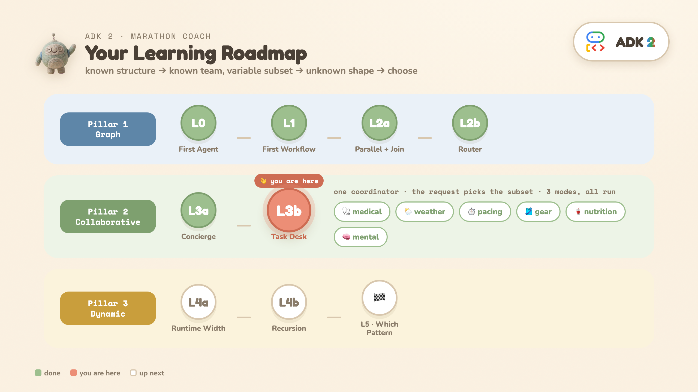

**⚡ TL;DR:** the middle mode — talk to the user **until the fields are collected**, then auto-return with a **validated object**.

**The question:** L3a left a gap. `chat` owns the whole conversation; `single_turn` never talks to the user at all. But real intake work sits in between: *"talk to the user UNTIL you've collected X — then come back with a validated object."* Which mode is that?

**The shape:**

```
race_desk (coordinator)
  └─ gear_fitter (mode="task", output_schema=GearOrder)
```

### Run it

In Cloud Shell, from the `adk2-tutorial` directory:

<ql-code-block language="bash">
python -m L3b_task_desk.desk
</ql-code-block>

<ql-code-block language="bash">
python -m L3b_task_desk.desk "I need a hydration vest" --reply "2 liters, medium"
</ql-code-block>

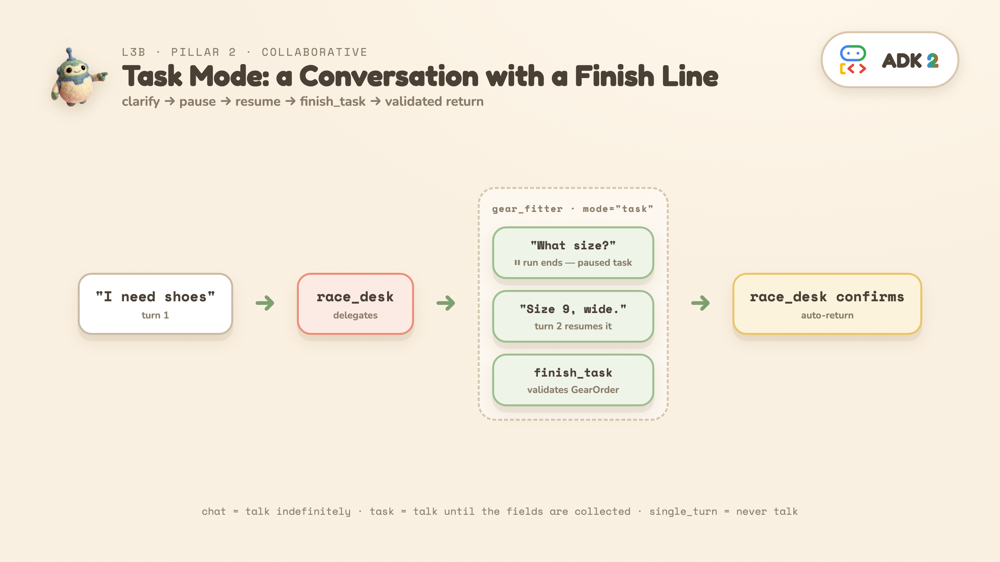


> 🔍 **The markers:** `mode="task"` + `output_schema=` on the *same* agent — and in the output, the ⏸ pause and the `finish_task` call.

**What you'll see:**

```
━━ TURN 1 ━━  user: 'I need shoes for the marathon.'
  race_desk → delegate: gear_fitter
  gear_fitter: What is your shoe size?
  ⏸  The run ENDED — but nothing failed. This is a PAUSED task.

━━ TURN 2 ━━  user: 'Size 9, wide.'   (same session → resumes the task)
  gear_fitter → finish_task   (payload validates as GearOrder)
  race_desk: Your order ... in size 9 Wide has been confirmed.
```

Three things happened that neither L3a mode can do:

1. **The run genuinely stopped mid-task** — a *paused* task, not a hang and not a failure. The agent asked its clarifying question and is holding the task open. (In `adk web` you'd just type the answer; the harness scripts it as a second message on the same session.)
2. **The next message resumed the SAME task agent** — no re-routing, no re-delegation. The session knows who was waiting.
3. **`finish_task` ended it** — a tool ADK injected *because* of `mode="task"`. The agent must call it to finish, and its payload must validate against `output_schema`. A conversation with a **typed finish line** — then control auto-returns to the coordinator, result attached.

### The one-question rule for picking a mode

> 💡 **"Does the user need to talk to it — and until WHEN?"** chat = indefinitely · task = until the fields are collected · single_turn = never.

| Mode | Human in the loop | Parallel? | Returns to parent |
| --- | --- | --- | --- |
| `chat` *(subagent default)* — support assistant, open-ended copilot | full conversation | no | manual (via transfer) |
| `task` — intake, booking, troubleshooting | clarifying questions only | no | automatic (via `finish_task`, with a validated object) |
| `single_turn` — classify · extract · judge · generate | none | **yes** | automatic (with its result) |

`mode` goes on **subagents only** — never on the coordinator. And workflow *nodes* default to `single_turn` (which is why L1–L2b never wrote it), while *subagents* default to `chat` (which is why L3a had to).

> ⚠️ Two version notes before you build on this: (1) **`task` as a static graph node is version-dependent** — on 2.0.0b1–2.3.0 (this lab's pin), `Workflow(...)` raises at construction; use exactly what this level does (a chat coordinator with task sub-agents) or dispatch via `ctx.run_node`. **Lifted in 2.5.0.** (2) **"Task agents must be leaf agents"** (no subagents of their own) is a documented ADK limitation — but a *contract*, not a runtime guard: neither 2.3.0 nor 2.5.0 will stop you. Don't read the absence of an error as permission.

> 💡 **Go deeper:** a `task` agent embedded in a *graph workflow* (the 2.5.0+ shape), with routing that can loop the conversation back for a retry: companion repo [`22_agent_in_workflow`](https://github.com/cuppibla/adk-workflows-compared/tree/main/examples/22_agent_in_workflow) · full mode guide: [`docs/agent-modes.md`](https://github.com/cuppibla/adk-workflows-compared/blob/main/docs/agent-modes.md).

> ❓ **You might be wondering:** *what does `task` buy me that the other two can't?* Three things: **auto-return** (chat carries the conversation away instead) · a **typed finish line** (`finish_task`'s payload must validate against the schema — you get data back, not a transcript) · **pause/resume** (the ⏸ is a held task waiting for a human, not a hang).

> 👀 **Read:** `gear_fitter` — `mode="task"` + `output_schema` is the entire contract. · ▶ **Run** it. · ✏️ **Change:** `run_desk("I need a hydration vest", "2 liters, medium")` — the clarifying question adapts, the finish line stays typed.

## Task 9. L4a · Runtime-sized parallel fan-out (Pillar 3a)


**⚡ TL;DR:** the skeleton is still three static steps — dynamic hides **inside** the middle one, where the width is decided by data at runtime.

> ⚠️ **Heads-up: this is the steepest step of the ladder.** The previous level was 44 lines; this one is ~120 — three agents and two workflow nodes, and none of it is padding. Budget ~15 minutes, and lean on the Read/Run/Change line at the end: you don't need to absorb every line on the first pass.

**The question:** the *shape* of the work depends on the input. You can't draw the graph ahead of time. Start with runtime **width**: let the LLM decide *how many* sub-questions.

**The shape (one level deep):**

```
START ─► decompose ─► research_topic (parallel_worker) ─► synthesize
                             │  │  │
                             └──┴──┴─ (flat: no children yet)
```

An open-ended question is **decomposed** into N sub-questions — **N is chosen by the LLM at runtime** (3–7) — each **researched in parallel**, then **synthesized** into one briefing.

<ql-warningbox>
<p><strong>Important:</strong> This cell makes <b>5–9 live LLM calls</b> (1 decompose + 3–7 research + 1 synthesize) and takes <b>~20–30s</b>. It costs real API quota.</p>
</ql-warningbox>

### Run it

In Cloud Shell, from the `adk2-tutorial` directory:

<ql-code-block language="bash">
python -m L4a_flat_research.deep_research
</ql-code-block>


> 🔍 **The markers — there is no `dynamic=True` switch.** Dynamic is a way of *writing*, not a config. Two markers and only two: `@node(parallel_worker=True)` (takes a runtime-sized list, runs one worker per item) and `ctx.run_node(...)` (code scheduling nodes directly). See either one → you're in dynamic.

**What you'll see:** the decomposer prints e.g. 5 sub-questions, they research in parallel, then a synthesized briefing. The *number* differs on every run — the fixed graph couldn't do that.

<ql-infobox>
<strong>Tip:</strong> <b>Where ADK 2 gives this a direct home:</b> <code>@node(parallel_worker=True)</code> fans one worker across a <b>runtime-sized</b> list. A 1.x <code>ParallelAgent</code> needs a fixed list known at build time; raw <code>asyncio</code> could size it at runtime, but then it is no longer a workflow ADK can trace.
</ql-infobox>

**Two flags on the worker worth understanding:**

- **`rerun_on_resume=True` is mandatory** on any node that calls `ctx.run_node` — ADK raises a `ValueError` without it. On resume it must re-execute the dispatching node to rebuild the children it spawned, since those aren't in the static graph.
- **`retry_config=` bounds how this FAILS.** A parallel worker cancels every sibling and re-raises the instant one child fails — so without a retry, a single transient 429 discards the whole run, including every call already paid for. The retry lands on the inner per-item node, so each branch retries independently.

> ❓ **You might be wondering:** *where does ADK "know" this is dynamic?* It doesn't need to — nothing is declared anywhere. The decomposer produces a list at runtime; the parallel worker sizes itself to whatever arrives. The dynamism is a property of the data flow you wrote, not a mode you switched on.

> 👀 **Read:** the two flags on `research_topic` — `parallel_worker` and `rerun_on_resume`. · ▶ **Run** it. · ✏️ **Change:** swap in your own open question — N changes because the *input* decided the width.

## Task 10. L4b · Add recursive spawning (Pillar 3b)

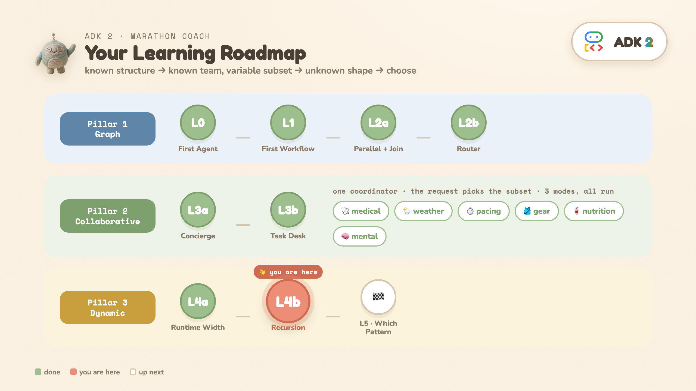

**⚡ TL;DR:** recursion is **written, not given** — the worker calls *itself* through `ctx.run_node`, ordinary Python — so the brake must be written too. That's `MAX_DEPTH`.

**The question:** one research finding sometimes surfaces a narrow sub-topic worth its own investigation. How do you let a branch **spawn more parallel work** — and keep it bounded?

**The shape (now recursive):**

```
START ─► decompose ─► research_topic (parallel_worker, recursive) ─► synthesize
                             │  │  │
                             │  │  └─ research(q3) ─► maybe spawn children
                             │  └─── research(q2) ─► maybe spawn children
                             └────── research(q1) ─► maybe spawn children
```

<ql-warningbox>
<p><strong>Important:</strong> This cell makes <b>5–30 live LLM calls</b> and takes <b>20–45s</b> — the ceiling is 1 decompose + 7 top-level + 7×3 children + 1 synthesize. Run it deliberately.</p>
</ql-warningbox>

### Run it

In Cloud Shell, from the `adk2-tutorial` directory:

<ql-code-block language="bash">
python -m L4b_recursion.deep_research
</ql-code-block>


<ql-code-block language="python">
@node(parallel_worker=True, rerun_on_resume=True)
async def research_topic(ctx, node_input):
    finding = coerce(await ctx.run_node(research_agent, node_input=...), ResearchFinding)
    if finding.needs_deeper and finding.deeper_questions and depth < MAX_DEPTH:   # boundary in CODE
        children = await ctx.run_node(research_topic, node_input=deeper)          # recursive fan-out
    yield Event(output={..., "children": children})
</ql-code-block>

> 🔍 **The markers:** `ctx.run_node(research_topic, …)` **inside** `research_topic` itself — self-reference *is* the recursion — and the guard `depth < MAX_DEPTH` one line above it.

**What you'll see:** research nodes printing `spawning N deeper` — recursion happening live — then a runtime tree shape (e.g. `5 top-level + 10 recursive children`). The tree differs on every run.

<ql-infobox>
<strong>Tip:</strong> <b>Where ADK 2 gives this a direct home:</b> runtime-sized <i>and</i> runtime-deep parallel fan-out with recursive <code>ctx.run_node</code>, all <b>inside the framework</b> — you keep tracing, checkpointing, and resumability. 1.x could recurse too, but only by dropping out to raw <code>asyncio</code>, which lost you all of that.
</ql-infobox>

<ql-infobox>
<strong>Tip:</strong> <b>The rule:</b> <i>let the LLM shape the work, but keep the boundaries in code.</i> <code>MAX_DEPTH = 2</code> means depth-2 children cannot spawn — there is no depth 3. Width is bounded too (3–7 sub-questions).
</ql-infobox>

> ⚠️ **Before you raise the knob:** the ceiling grows fast — `MAX_DEPTH=3` takes the worst case from ~30 calls to ~93. And at the very end of a run you may see a `cancelling N leftover tasks` log line: that's ADK tearing down its parallel task group after the result is already complete. Harmless — and depending on your logging config you may never see it.

> ❓ **You might be wondering:** *isn't dynamic recursive by default?* No — L4a is fully dynamic with **zero** recursion. Dynamic only hands you ordinary Python control flow; L4b *chooses* to write recursion with it. And because **you** wrote the recursion, **you** must write its boundary — this is where *"let the LLM shape the work, keep the boundaries in code"* stops being a slogan.

> 👀 **Read:** the guard: `if finding.needs_deeper and depth < MAX_DEPTH`. · ▶ **Run** it. · ✏️ **Change:** set `MAX_DEPTH = 1` and re-run — the tree flattens (and the run gets cheaper). The boundary is YOURS, in code.

## Task 11. L5 · Which pattern should you use?


**⚡ TL;DR:** one axis decides everything — **who picks the next step: the graph you drew, the LLM, or your code.**

You've built all three. This is the model that makes them useful: **match the pattern to the shape of your problem.**

### The axis: who decides what runs next?

| Pillar | Who decides what runs next | Built in |
| --- | --- | --- |
| **1 · Graph** | the graph you drew | L2a / L2b |
| **2 · Collaborative** | the LLM | L3a / L3b |
| **3 · Dynamic** | your Python code, at runtime | L4a / L4b |

### Step 0: do you even need a graph?

ADK ships **prebuilt workflow agents** — `SequentialAgent`, `ParallelAgent`, `LoopAgent`. For a plain chain of agents, those are the cheapest correct answer and there's no graph to assemble. Reach past them when you need **explicit routing** (L2b's router), a **join** (L2a's `JoinNode`), or **nodes that aren't agents** (a plain function, zero LLM calls) — that last one is usually the reason.

```
Would a prebuilt SequentialAgent / ParallelAgent / LoopAgent do?
│
├─ YES ──────────────────────────────► use it; stop here
│
└─ NO — I need routing, a join, or non-agent nodes
   │
   Can you draw the workflow before the input arrives?
   │
   ├─ YES ───────────────────────────► Pillar 1 · Graph workflow    (L2a/L2b)
   │
   └─ NO
      ├─ Known team, request picks the subset? ─► Pillar 2 · Collaborative  (L3a/L3b)
      └─ Does the shape depend on the input?  ──► Pillar 3 · Dynamic        (L4a/L4b)
```

<ql-warningbox>
<p><strong>Important:</strong> <b>What this lab did not teach you.</b> Nine rungs, ~50 minutes — the scope is deliberate. <b>Loops</b> (generate → review → fix in a <code>while</code>) are the canonical dynamic shape and aren't here; neither is graph-workflow <b>human input</b> (<code>RequestInput</code> — L3b's paused <i>task</i> is the collaborative cousin, not the graph node); and L4b's <b>resumability</b> is asserted but never demonstrated. All of it is covered in the companion repo <a href="https://github.com/cuppibla/adk-workflows-compared"><b>adk-workflows-compared</b></a> — see <a href="https://github.com/cuppibla/adk-workflows-compared/tree/main/examples/07_loop"><code>07_loop</code></a>, <a href="https://github.com/cuppibla/adk-workflows-compared/tree/main/examples/17_request_input"><code>17_request_input</code></a>, and <a href="https://github.com/cuppibla/adk-workflows-compared/blob/main/docs/three-pillars.md"><code>docs/three-pillars.md</code></a>.</p>
</ql-warningbox>

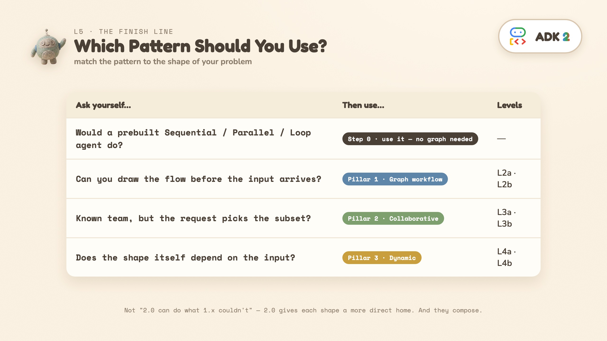

### The honest 1.x-vs-2 framing

This is **not** "2.0 can do things 1.x couldn't" — 1.x could build all of it. The shift is that **2.0 gives each shape a more direct home**, so known control flow leaves the prompt and becomes structure you can see and test.

| Pattern | The 1.x cost | The ADK 2 home |
| --- | --- | --- |
| **Graph** | 4 LLM calls in the common build; routing hidden in a prompt | function + agent nodes as peers → 1 call, `if`-statement router |
| **Collaborative** | buildable via `AgentTool` plumbing; `ParallelAgent` always-all, `transfer_to_agent` serial | a **declared** team: `sub_agents` + `mode="single_turn"` |
| **Dynamic** | recursion drops you out of the framework | `parallel_worker` + recursive `ctx.run_node` inside the framework |

### What you can build now

Each pattern you just ran is a real product shape:

| You practiced | In the wild, that's | Start from |
| --- | --- | --- |
| Graph + router (L2a/L2b) | document pipelines, ETL-with-LLM-steps, review/approval chains, eval harnesses | this repo's L2b |
| Coordinator + `single_turn` team (L3a) | a support copilot with specialist teams, triage desks, multi-lens review | [marathon demo](https://github.com/cuppibla/adk-2-marathon-demo) mode 2 |
| `task` agents (L3b) | intake forms, booking flows, onboarding, KYC — any "collect then act" | [`22_agent_in_workflow`](https://github.com/cuppibla/adk-workflows-compared/tree/main/examples/22_agent_in_workflow) |
| Dynamic width/depth (L4a/L4b) | research agents, report generators, audit sweeps over unknown-sized inputs | [marathon demo](https://github.com/cuppibla/adk-2-marathon-demo) mode 3 |

### They compose

The three patterns are **not mutually exclusive**. A graph node can call a collaborative coordinator; a specialist can launch a dynamic workflow. Choose the right pattern per *part* of the problem — that's how you avoid turning every agent system into one giant prompt.

## Task 12. Congratulations

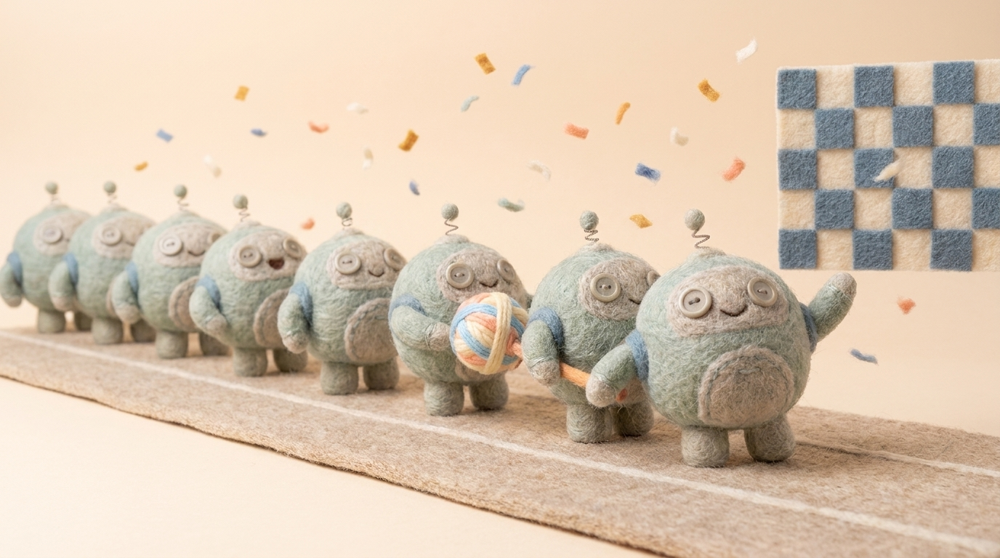

You built a Marathon Race Day Coach and, along the way, all three of ADK 2's orchestration patterns.

### What you learned

- **Prologue** — the mega-prompt that *invented its own weather*: why structure exists at all.
- **L0–L1** — `Agent`, `Runner`, a real **tool** the model chooses to call, and your first `Workflow` (function nodes + agent nodes as peers).
- **L2a / L2b** — graph workflows: parallel fan-out + `JoinNode`, then deterministic routing — one LLM call.
- **L3a** — collaborative agents: the same team run in `chat` (stranded) then `single_turn` (parallel subset + synthesis) — one flag, two worlds.
- **L3b** — `task` mode: a paused clarifying question, a scripted resume, `finish_task` returning a validated object.
- **L4a / L4b** — dynamic workflows: runtime width (fan-out), then runtime depth (recursion) with boundaries in code.
- **L5** — the decision tree, and how the patterns compose.

### Lines worth keeping

> *Functions prepare the context. Edges define the workflow. The router chooses the path. The model writes the answer.*
>
> *Let the LLM shape the work, but keep the boundaries in code.*
>
> *Match the pattern to the shape of your problem.*

### Next steps

- Run the full app these levels were distilled from — the **Marathon Race Day Coach**, a FastAPI + SSE build with a browser UI showing all three modes live: [github.com/cuppibla/adk-2-marathon-demo](https://github.com/cuppibla/adk-2-marathon-demo).
- Go wider: [**adk-workflows-compared**](https://github.com/cuppibla/adk-workflows-compared) — all 23 official ADK 2 workflow samples, each with a 1.x port and when-to-use guidance. Start with [`docs/three-pillars.md`](https://github.com/cuppibla/adk-workflows-compared/blob/main/docs/three-pillars.md), then the things this lab skipped: [`07_loop`](https://github.com/cuppibla/adk-workflows-compared/tree/main/examples/07_loop), [`17_request_input`](https://github.com/cuppibla/adk-workflows-compared/tree/main/examples/17_request_input), [`22_agent_in_workflow`](https://github.com/cuppibla/adk-workflows-compared/tree/main/examples/22_agent_in_workflow).
- Port your **own** problem: which parts are known-structure (L2), known-team (L3a/L3b), unknown-shape (L4)?
- Explore the code: [github.com/cuppibla/adk2-tutorial](https://github.com/cuppibla/adk2-tutorial).
